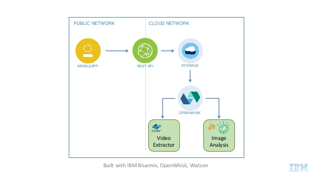

# Darkvision Blueprint

[](https://travis-ci.org/IBM-Bluemix/openwhisk-darkvisionapp) 

An IBM Bluemix Blueprint to provision and manage infrastructure for the [OpenWhisk Darkvision App](https://github.com/IBM-Bluemix/openwhisk-darkvisionapp)

This Blueprint will allow you to provision and manage infrastructure as a single unit using [Terraform](http://terraform.io). This Blueprint can be used with the [IBM Bluemix Blueprint Service](http://bluemix.com) 

It will deploy the following architecture:



This is comprised of the following components:

  * [Watson Visual Recognition](https://console.ng.bluemix.net/catalog/services/watson_vision_combined)
  * [OpenWhisk](console.ng.bluemix.net/openwhisk/)
  * [Cloudant](https://console.ng.bluemix.net/catalog/services/cloudantNoSQLDB)
  * [Object Storage](https://console.ng.bluemix.net/catalog/services/Object-Storage)

## Using this Blueprint

To use this Blueprint from your local workstation, you'll first need to download [Terraform](htp://terraform.io) and be sure you've read the [Terraform Getting Started Guide](https://www.terraform.io/intro/getting-started/install.html).

You can see the infrastructure that this Blueprint will create by using this repository as a [Terraform module](https://www.terraform.io/intro/getting-started/modules.html), writing the necessary configuration and supplying the necessary variables, then running `terraform plan`.

1. Configure the [Terraform Bluemix Provider](https://www.terraform.io/docs/providers/softlayer/index.html).
2. Configure the module:
  Example:

  ```hcl
  module "darkvision_app" {
    source  = "https://github.com/IBM-Blueprints/darkvision-blueprint"
    name    = "my-darkvision-app"
    tier    = "dev"
  }
  ```
  - `name`: This should be a name you want to give to this instantiation for the Darkvision stack. This value will be used on all created resources for identification purposes in Bluemix.
  - `tier`: This should be the "tier" (e.g. dev, qa, int, prod) which you are targeting.  This value will be used on all created resources for identification purposes in Bluemix, it has no bearing on how resources are deployed or how many are deployed, it is for organizational purposes only.

You can then provision the infrastructure by running a `terraform apply`.

## Feedback

Please use GitHub issues to communicate bugs or improvements you wouldd like to see in this Blueprint.

-------------------------------------

_This is for demostration purposes only; this repository does not contain working code_
